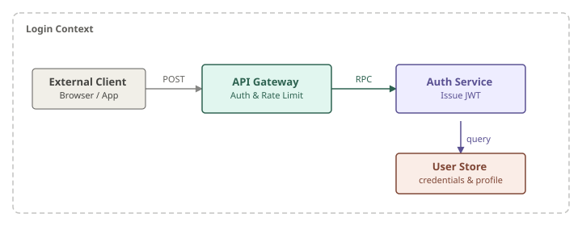
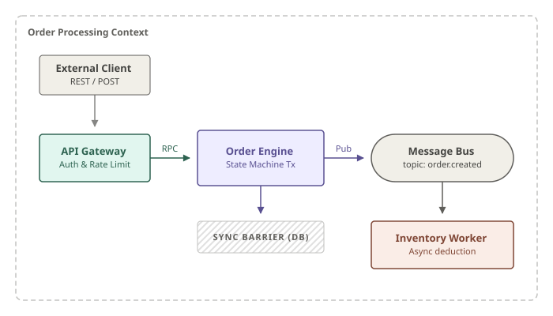
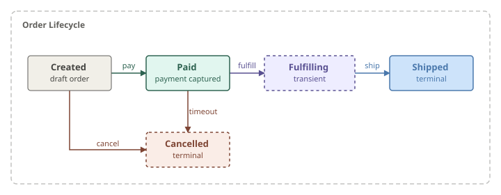

# 技术架构图 SVG 生成器 (AI Agent Skill)

专为 Cursor 和各类 Coding Agent 设计的 Prompt Skill，用于指导 AI 生成高质量、高审美的技术架构图、流程图和状态机（基于原生 SVG）。

## 生成示例

按本 Skill 规则绘制。源文件在 [`examples/`](examples/)。

**登录流程**（网关、鉴权、数据库）



**订单处理与异步事件分发**



**订单生命周期状态机**



## 为什么需要这个 Skill？

目前大多数 AI Agent 在被要求画图时，默认会生成 Mermaid.js 代码。虽然 Mermaid 非常适合快速草图，但当您需要为**技术博客、官方文档或学术演示**准备配图时，它的排版和审美往往显得过于简陋和不可控。

这个 Skill 的核心理念是：**绕过 Mermaid，指导 AI 直接编写原生 SVG 代码**。通过注入一套从顶级技术文章中提取的严格设计规范（Design System），让 AI 能够稳定输出极具专业感和现代审美的图表。

## 核心特性

- **莫兰迪色系**：绿、紫、陶红、蓝、暖灰五色，浅底 + 同色深描边/文字；不用 Material 高饱和主色，也不用实心彩色表头。
- **完美的文本排版**：强制使用原生 SVG 的 `<text>` 和 `<tspan>` 结合 `text-anchor="middle"`，确保文本在任何 Markdown 预览器和 GitHub 页面中都能完美居中和渲染（不使用兼容性差的 `<foreignObject>`）。
- **动名词分离**：严格规范“实体（名词）”放在带边框的矩形中，而“动作/事件（动词）”作为标签悬浮在箭头上，使图表逻辑清晰、不臃肿。
- **正交连线**：强制使用直角折线（Orthogonal Routing），连线画在节点下方；箭头上的动作标签无底色，略偏离线段以免被线穿过。

## 安装

本仓库根目录的 `SKILL.md` 就是完整 skill 包。安装到 Cursor 项目：

```bash
mkdir -p .cursor/skills/tech-diagram
cp SKILL.md .cursor/skills/tech-diagram/
```

或使用 skills CLI：

```bash
npx skills add rikkiwang1224/tech-diagram
```

其他 Agent 框架（Claude、GPT-4 等）可将 `SKILL.md` 内容复制到系统提示词或自定义指令中。

## 更新

用 skills CLI 安装的，在项目目录执行：

```bash
npx skills check
npx skills update
```

只更新本 skill：

```bash
npx skills update tech-diagram
```

全局安装的加上 `-g`。手动复制 `SKILL.md` 的，重新复制仓库里的最新文件即可。更新后新开一轮对话，Agent 才会重新加载。

## 使用方法

安装完成后，向 AI Agent 下达画图指令即可：

> “画一个用户登录的流程图，包含网关、鉴权和数据库。”
> “生成我们微服务架构的组件图。”
> “画一个订单生命周期的状态机。”

AI 会读取 `SKILL.md` 中的规则，并输出一段可直接预览的 SVG 代码。
